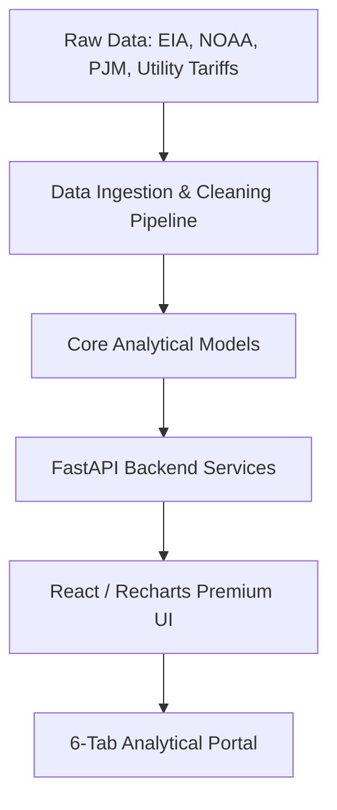
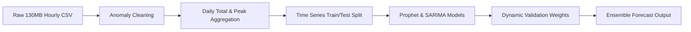
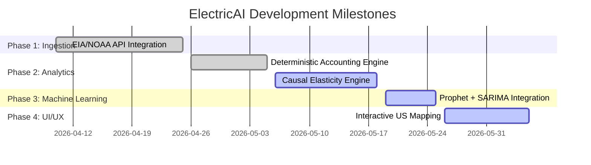

# ElectricAI: Electricity Cost Intelligence & Analytics Platform
## Complete Project Overview, System Architecture, and Core Objectives

---

> [!NOTE]
> This master document serves as the absolute blueprint and technical handbook for **ElectricAI**. It outlines the core business domain, active software components, analytical models, and strategic development objectives of the application.

---

## 1. Executive Summary

**ElectricAI** is a state-of-the-art, premium Web-based Analytics and AI Platform designed to demystify household and industrial electricity cost dynamics, forecast utility load profiles, and conduct rigorous statistical and causal analysis of power rates.

Modern electric bills are deceptively complex, combining:
* **Fixed costs** (system charges, connection fees)
* **Volumetric rates** (generation/Basic Generation Service (BGS), transmission, distribution, societal benefits charges)
* **Dynamic variables** (fuel adjustments, seasonal spikes, demand response adjustments)

ElectricAI translates these confusing volumetric tariffs and raw grid-level signals into clear, actionable, and deterministic narratives. By marrying robust financial accounting engines with time-series machine learning models (Prophet and SARIMA) and geographic benchmarking indices (EIA and NOAA weather data), the platform empowers consumers, property managers, and analysts to take control of their carbon footprint and financial liability.

---

## 2. Strategic Objectives

### 🎯 Primary Project Goal
To build a highly responsive, robust, and visually stunning decision-intelligence portal that aggregates electricity rate structures, models volumetric consumption, forecasts grid demand, simulates "what-if" rate adjustments, and exposes AI-explained billing insights.



### 📈 Core Platform Objectives
1. **Explainable Billing (Overview Tab)**: Dissect complex, multi-tiered bill profiles into deterministic sub-components (delivery, generation, taxes, adjustment credits) and utilize Large Language Models (LLMs) with statistical fallbacks to provide natural language narratives on usage anomalies.
2. **Predictive Grid Modeling (Forecast Tab)**: Utilize massive real-world PJM balancing area datasets (130MB+) to train dynamic, high-accuracy machine learning ensembles (Prophet + SARIMA) that predict grid-level daily load factors and peak capacity demands.
3. **Deterministic & Causal Sensitivity (Impact Tab)**: Build a dual-engine simulator:
   * *Accounting Decomposition Engine*: Quantify the deterministic dollar impact of rate vs. usage adjustments.
   * *Statistical Causal Inference Engine*: Control for weather (HDD/CDD) and pricing confounders using Double Machine Learning (DML) or structural causal models to estimate the true elasticity of customer demand.
4. **Regional Price Benchmarking (Benchmark Tab)**: Integrate U.S. Energy Information Administration (EIA) monthly state-level retail databases to compute regional volatility, price ranking, and load profiles on interactive maps and comparative charts.
5. **Geographic Rate Tracking (Geo Tab)**: Query localized rate indices (e.g., PSE&G rate histories) mapped to ZIP codes, providing dynamic alerts and statistical insight summaries for micro-regions.
6. **Market Comparison (Plans Tab)**: Match real-time retail supplier plans (variable vs. fixed, green generation percentage, exit penalties) against standard utility defaults (BGS) to determine maximum consumer savings.

---

## 3. Platform System Architecture

ElectricAI uses a decoupled, high-performance web architecture designed for rapid analysis and smooth UX.

```
                  ┌─────────────────────────────────────────┐
                  │            React SPA Frontend           │
                  │        (TypeScript / TailwindCSS)       │
                  └────────────────────┬────────────────────┘
                                       │
                                       │ HTTP REST Requests
                                       ▼
                  ┌─────────────────────────────────────────┐
                  │             FastAPI Backend             │
                  │            (Python 3.10+)               │
                  └────────────────────┬────────────────────┘
                                       │
            ┌──────────────────────────┼──────────────────────────┐
            ▼                          ▼                          ▼
┌───────────────────────┐  ┌───────────────────────┐  ┌───────────────────────┐
│  Analytical Engines   │  │   Predictive Models   │  │   Ingestion Pipeline  │
│  • Bill Decomposition │  │   • Prophet Ensemble  │  │   • EIA API Ingest    │
│  • Causal Inference   │  │   • Seasonal SARIMAX  │  │   • NOAA Weather Ingest│
│  • Elasticity Math    │  │   • Model Metrics     │  │   • PJM Grid Sync     │
└───────────────────────┘  └───────────────────────┘  └───────────────────────┘
```

### 💻 Frontend Tech Stack
* **Vite + React (TypeScript)**: Delivers instant page loads, reactive state management, and strict modular typing.
* **Recharts**: Renders premium, interactive charts with custom animated tooltip layers and confidence interval fills.
* **Lucide React**: Provides unified, clean SVG iconography.
* **TailwindCSS / Custom CSS Rules**: Uses modern, premium design aesthetics (glassmorphism, vibrant but unified color palettes, subtle transitions, responsive CSS Grid structures).

### ⚙️ Backend Tech Stack
* **FastAPI**: Provides asynchronous endpoint handling, automatic OpenAPI/Swagger documentation, and clean Pydantic schema verification.
* **Pandas & NumPy**: Drives fast, memory-efficient data transformations on high-volume datasets.
* **Prophet & Statsmodels**: Power time-series model fitting and statistical stationary testing (Augmented Dickey-Fuller).
* **DoWhy**: Facilitates formal causal graphs and treatment estimation.

---

## 4. Module Deep-Dive: The 6-Tab Analytical Engine

The user interface is segmented into six powerful tabs, each mapped to dedicated backend endpoints and analytical packages.

### Tab 1: Overview Tab — Bill Explanation & Trends
* **Backend Module**: `api/routes/billing.py`, `api/routes/dashboard.py`
* **Objective**: Surface structural charges and generate explanatory reports for non-technical users.
* **Features**:
  * **Bill Decomposition**: Segregates delivery fees (transmission + distribution + societal benefits charges) from supply fees (BGS commodity charges).
  * **Interactive Trendlines**: Shows monthly bills vs. baseline usage profiles.
  * **AI Narrative Generator**: Translates tabular anomalies into descriptive text (e.g., *"Your July bill increased by 14% due to a 3-day extreme heatwave which spiked your CDD from 120 to 185"*).

---

### Tab 2: Forecast Tab — Demand Forecasting
* **Backend Module**: `models/forecast_model.py`, `api/routes/forecast.py`
* **Objective**: Generate 7-day and 30-day electricity demand predictions with rigorous confidence bounds.
* **Data Origin**: Live/Local EIA PJM Hourly grid load database (`data/raw/eia_pjm_hourly_demand.csv`).
* **Analytical Flow**:



* **Metrics & Evaluation**: Exposes Mean Absolute Error (MAE), Root Mean Squared Error (RMSE), and Mean Absolute Percentage Error (MAPE). Displays a **Confidence Score** based directly on validation metrics.

---

### Tab 3: Impact Tab — Accounting Decomposition & Sensitivity
* **Backend Module**: `models/impact_model.py`, `shared/bill_analytics.py`, `api/routes/impact.py`
* **Objective**: Separate deterministic accounting identity changes from behavioral usage shifts.
* **Methodology**:
  * **Accounting Identity**:
    $$\text{Total Bill} = \text{Fixed Charges} + \sum (\text{Usage} \times \text{Volumetric Rate}_i) + \text{Taxes}$$
  * **Decomposition Engine**: Quantifies the contribution of rate modifications vs. usage anomalies to total bill fluctuations.
  * **Scenario Simulator**: Allows users to dynamically change tariff rates (e.g., +15% Distribution Rate) or target usage (e.g., -10% Conservation) and instantly plots the modeled bill change against historical baselines.

---

### Tab 4: Benchmark Tab — EIA National & State Comparisons
* **Backend Module**: `data_pipeline/benchmark_builder.py`, `api/routes/benchmark.py`
* **Objective**: Contextualize a user's pricing compared to national, regional, and state benchmarks.
* **Features**:
  * **EIA Ingest Pipeline**: Reads live residential prices, revenues, and sales datasets.
  * **Interactive US Map**: Color-codes states by retail price ranking ($/kWh) and consumption averages.
  * **Volatility Ranking**: Highlights regions subject to extreme seasonal pricing adjustments.

---

### Tab 5: Geo Tab — localized GIS Insights
* **Backend Module**: `shared/geo_analytics.py`, `api/routes/geo_insights.py`
* **Objective**: Capture localized, climate-adjusted power rate histories.
* **Features**:
  * **ZIP Code Directory**: Maps local distribution companies (LDCs) to specific ZIP zones.
  * **Historical Volatility Analysis**: Surfaces long-term tariff curves (e.g., PSE&G NJ rate history database).
  * **Statistical Fallback Narrative**: Creates reliable summary narratives for micro-regions, safeguarding against external model outages.

---

### Tab 6: Plans Tab — Utility Rate & Supplier Comparisons
* **Backend Module**: `api/routes/plans.py`
* **Objective**: Evaluate alternative supplier offers against default utility BGS (Basic Generation Service) rates.
* **Features**:
  * **Financial Comparison Table**: Renders fixed vs. variable rates, early termination fees (ETF), and contract durations.
  * **Green Metric Scoring**: Renders green power percentages (0–100%) against baseline rate premiums.
  * **Savings Calculator**: Estimates projected annualized savings based on historical customer usage patterns.

---

## 5. Core Ingestion Data Schema

The platform maintains strict parquet schemas to guarantee speed and data validation:

| Dataset Name | Source | Key Columns | Frequency | Purpose |
| :--- | :--- | :--- | :--- | :--- |
| `eia_pjm_hourly_demand.csv` | EIA / PJM | `period`, `subba`, `value` | Hourly | Demand Forecasting Engine |
| `pseg_rate_history.csv` | Utility Filings | `date`, `charge_type`, `rate_code`, `value` | Monthly | Micro-regional tracking |
| `weather.parquet` | NOAA | `date`, `avg_temp_f`, `hdd`, `cdd` | Daily | Weather Adjustments & Controls |
| `state_benchmark.parquet` | EIA Retail | `state`, `year`, `avg_rate`, `avg_bill` | Annual/Monthly | GIS Benchmarking Tab |
| `retail_plans.parquet` | Market Scrapes | `provider`, `rate`, `type`, `etf`, `green_pct` | Real-time | Supplier savings calculations |

---

## 6. Implementation Plan & Next Steps



### 🚀 Planned Platform Enhancements
1. **Real-time API Ingestion Policies**: transition local fallbacks to dynamic webhooks checking EIA price files and NOAA station reports daily.
2. **Deep-Learning Demand Forecasting**: Supplement the current ML ensemble (Prophet/SARIMA) with an LSTM (Long Short-Term Memory) or Temporal Fusion Transformer (TFT) network for complex peak-demand modeling.
3. **Smart Thermostat Smart Integration**: Connect with Nest or Ecobee API schedules to compute automated demand response potential during high wholesale pricing events.
