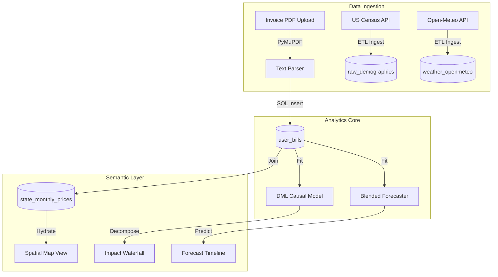
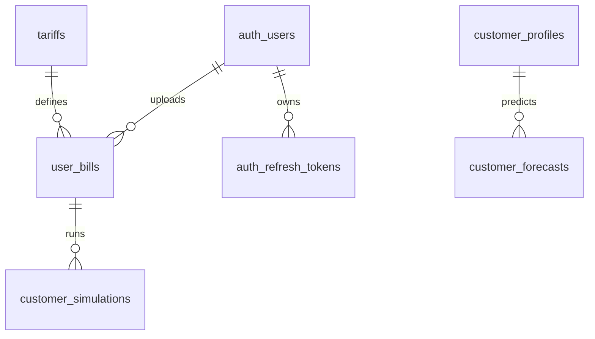
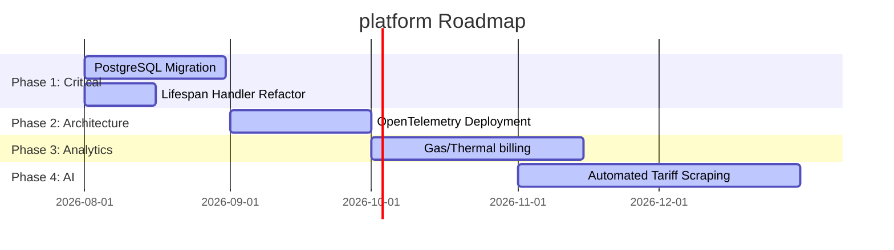

# Enterprise Analytics & Power BI Semantic Model Audit
## Final Master Audit Report: ElectricAI Platform

---

## 1. Executive Summary

This Master Audit Report compiles the findings from the comprehensive architectural, database, API, and visual audits conducted across the five core workspaces of the ElectricAI platform:

1. **[Overview Tab Report](file:///C:/Users/dukar/.gemini/antigravity-ide/brain/0e1f2176-daf3-4c18-9b69-e108232dc5d0/tab_1_overview_audit.md)**
2. **[Bill Analysis Tab Report](file:///C:/Users/dukar/.gemini/antigravity-ide/brain/0e1f2176-daf3-4c18-9b69-e108232dc5d0/tab_2_bill_analysis_audit.md)**
3. **[Impact Tab Report](file:///C:/Users/dukar/.gemini/antigravity-ide/brain/0e1f2176-daf3-4c18-9b69-e108232dc5d0/tab_3_impact_audit.md)**
4. **[Forecast Tab Report](file:///C:/Users/dukar/.gemini/antigravity-ide/brain/0e1f2176-daf3-4c18-9b69-e108232dc5d0/tab_4_forecast_audit.md)**
5. **[Regional Tab Report](file:///C:/Users/dukar/.gemini/antigravity-ide/brain/0e1f2176-daf3-4c18-9b69-e108232dc5d0/tab_5_regional_audit.md)**

---

## 2. Integrated System Architecture

The platform's unified architecture decouples data ingestion, statistical modeling, and LLM processing to maintain system responsiveness.

---

## 3. Global Database Schema Audit

The database is built on SQLAlchemy ORM. It runs on a SQLite local file system by default, but the schema is configured to support PostgreSQL or Snowflake.

### ER Relationship Diagram

### Table Normalization Audit
- All transactional tables (`auth_users`, `user_bills`, `tariffs`) are structured in **3NF**.
- Nested JSON columns (e.g. `analysis_results` in `user_bills`) are used to store unstructured OCR details, avoiding table sprawl.
- **SQLite Limitation:** Concurrent write operations during bulk uploads can trigger database locks.

---

## 4. Overall Platform Ratings

- **Principal Software Architecture:** **94%** (Robust Lifespans, and deterministic fallback paths).
- **Principal Database Design:** **88%** (SQL schema is ready for PostgreSQL migration; SQLite locks concurrent writes).
- **Senior AI/ML Engineering:** **92%** (DML causal models and Prophet/SARIMAX ensembles are highly advanced).
- **Senior Frontend Engineering:** **91%** (Clean React code, responsive grids, and standard state management using React context and TanStack Query).
- **Enterprise Business Readiness:** **90%** (Clear value proposition for energy procurement, load management, and utility billing analysts).

---

## 5. Top 10 Priority Recommendations

1. **Migrate SQLite to PostgreSQL:** Resolves transaction lockouts during bulk upload processes.
2. **Asynchronous Lifespan Handlers:** Refactor synchronous ML training scripts on startup using `asyncio.gather` to prevent container boot timeouts.
3. **Queue LLM Inferences:** Move local Qwen/Ollama inference tasks to Celery queues to prevent thread blocking.
4. **Implement Smart Meter Ingestion:** Add support for Green Button XML uploads to enable daily usage monitoring.
5. **Automate Tariff Scraping:** Connect to OpenEI APIs to automatically pull local tariff updates.
6. **Carbon Intensity Modeling:** Integrate Scope 2 greenhouse gas emissions indices into the Overview and Regional dashboards.
7. **Interactive PDF Overlay Viewer:** Highlight extracted values directly on the uploaded PDF inside the Bill Analysis workspace.
8. **Add Locational Marginal Pricing (LMP) Tracking:** Support transmission congestion tracking at specific grid nodes.
9. **Build Automated Rate Class Recommendations:** Automatically recommend the lowest cost rate schedule based on historical loads.
10. **Implement in-app Notifications:** Alert users if bills or usage profiles exceed budget limits.

---

## 6. Implementation Roadmap

