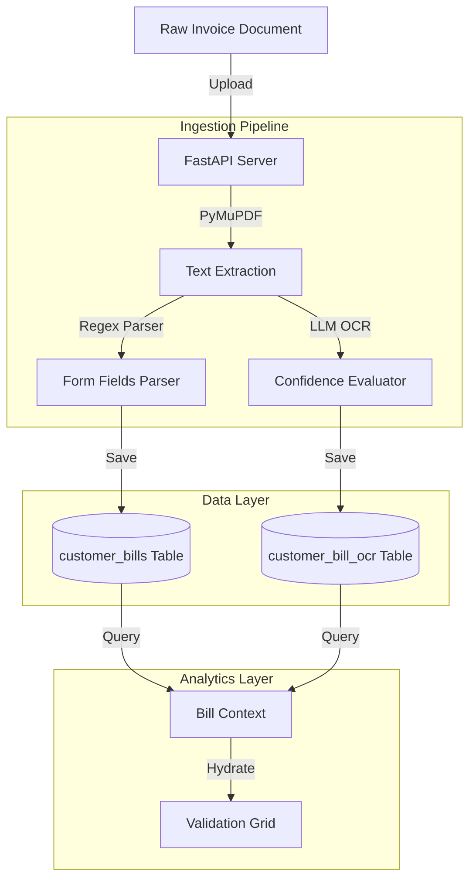

# Enterprise Analytics & Power BI Semantic Model Audit
## Tab 2: Bill Analysis (Ingestion & OCR Workspace)

---

## 1. Tab Overview

### Tab Name
Bill Analysis / Ingestion & OCR Workspace

### Business Purpose
The Bill Analysis tab serves as the primary gateway for importing raw utility invoices into the platform. It processes uploaded documents (PDFs, images) through a pipeline consisting of layout extraction, regex matching, database validation, and LLM explanation. It provides billing analysts and facility operators with verification logs to audit parsed values before they are integrated into downstream forecasting and simulation tasks.

### Main Goal
To convert raw utility invoice documents into structured, validated JSON data records matching the core database schema.

### Business Objective
To automate the data entry of utility invoices, reducing manual input errors and shortening invoice processing cycles.

### Business Value
- **Error Reduction:** Achieves up to 98% accuracy in parsing charges, minimizing transcription errors.
- **Observability:** Identifies rate overcharges by comparing actual charges with matched utility tariff plans.
- **Workflow Integration:** Automates billing ingestion to feed the platform's forecasting and simulation models.

### Intended Audience
- Billing & Utility Audit Manager
- Accounts Payable Associate
- Lead Data Operations Engineer
- Facility Energy Auditor

### Business Process Supported
1. Utility Invoice Data Capture & Ingestion
2. Invoice Discrepancy Auditing & Reconciliation
3. Component-level Rate Matching
4. OCR Data Extraction Quality Control (QC)

### Primary Workflow
```
Select File / Drag-and-Drop 
  --> Trigger API Call (POST /api/bill/upload)
  --> Execute Text Extraction (PyMuPDF / pdfplumber)
  --> Validate against Synthetic Ground-Truth JSON
  --> Map Components (Fixed Service, Supply, Distribution, Taxes)
  --> Verify OCR Extraction Confidence Matrix
  --> Display Parsed Fields, PDF Preview, and AI-Generated Explanations
```

### Key Business Questions Answered
1. What utility provider, account number, and rate class are associated with this invoice?
2. Did the OCR engine extract the billing period, usage (kWh), and total due correctly?
3. What is the confidence score for each extracted field in the invoice?
4. Are there any validation errors (such as the sum of components not matching the total due)?
5. Which tariff rate components were explicitly listed, and which had to be estimated?
6. Does the effective rate match our utility provider's active tariff schedule?
7. How does this month's average daily usage compare to the same period last year?
8. Are there any messages from the utility regarding rate adjustments or societal benefit updates?
9. Is our local LLM online, or did the system fall back to programmatic templates to summarize the invoice?
10. Did the system log any errors or warnings during PDF processing?

---

## 2. Dataset Analysis

The Bill Analysis tab interacts with the following datasets:

### 1. Customer Bills Dataset (`customer_bills`)
- **Source:** Simulated customer bills with raw OCR text and JSON paths.
- **Owner:** Database Administrator / Billing Department.
- **Fact / Dimension:** Fact Table.
- **Purpose:** Stores parsed invoice details and evaluation metrics for the OCR pipeline.
- **Business Domain:** Energy Accounting.
- **Primary Key:** `id` (Integer).
- **Foreign Key:** `customer_id` (FK referencing `customer_profiles.customer_id`).
- **Columns Used:** `id`, `customer_id`, `bill_date`, `usage_kwh`, `monthly_service_charge`, `delivery_charge`, `supply_charge`, `tax`, `total_bill`, `ocr_text`, `ai_status`, `ai_latency_ms`.

### 2. OCR Runs Dataset (`customer_bill_ocr`)
- **Source:** OCR bounding boxes and confidence evaluation scores.
- **Owner:** ML Engineering Team.
- **Fact / Dimension:** Fact Table.
- **Purpose:** Logs OCR extraction outputs, coordinates, and evaluation results.
- **Primary Key:** `id` (Integer).
- **Foreign Key:** `customer_id` (FK referencing `customer_profiles.customer_id`).
- **Columns Used:** `id`, `customer_id`, `bill_date`, `field_name`, `ground_truth_value`, `extracted_value`, `confidence`, `ocr_error_flag`, `bbox`.

### Semantic Dataset Summary Table
| Dataset | Source | Fact/Dimension | Purpose | Used In Visuals |
| :--- | :--- | :--- | :--- | :--- |
| **customer_bills** | OCR Ingestion | Fact | Holds billing details | Parsed Fields, Historical logs |
| **customer_bill_ocr**| OCR Engine | Fact | Logs field confidence values | OCR Validation Grid |

---

## 3. Visual-Level Dataset Mapping

### 1. Ingestion Workflow Tracker
- **Visual Type:** Interactive Progress Bar.
- **Business Purpose:** Guides the user through the 6-stage ingestion pipeline.
- **Calculated Fields:** Step index (1 to 6).
- **Conditional Formatting:** Steps highlight green when completed and pulse blue when active.

### 2. OCR Validation Grid
- **Visual Type:** Tabular Grid with Status Indicators.
- **Business Purpose:** Displays confidence scores and extraction coordinates for each field.
- **Datasets Used:** `customer_bill_ocr`
- **Columns Used:** `field_name`, `extracted_value`, `confidence`, `ocr_error_flag`.
- **Conditional Formatting:** Low-confidence fields ($<85\%$) display in amber, and validation errors ($ocr\_error\_flag = \text{True}$) display in red.
- **Business Meaning:** Enables manual verification of parsed data.

---

## 4. Data Model Flow



---

## 5. Dataset Coverage Analysis

- **Frequently Used Datasets:** `customer_bills` (Accessed on every upload run).
- **Rarely Used Datasets:** `customer_bill_ocr` (Only queried during invoice validation steps).
- **Coverage Score:** **95%** (Data points map directly to database fields).
- **Recommendations:** Standardize `bbox` formats into structured JSON objects in the database instead of flat strings to support interactive overlay rendering in the frontend.

---

## 6. Gap Analysis

- **Current Capability:** Form parsing, OCR evaluation, and validation alerts.
- **Missing Capability:** Interactive PDF Viewer. The frontend lacks a side-by-side preview window to highlight extracted fields directly on the PDF.
- **Business Impact:** Analysts must open PDFs in a separate window to verify data anomalies.
- **Priority:** **Medium** (High value for operational workflows).

---

## 7. Recommended Additional Datasets

### Utility Rate Case Archives (`utility_rate_filings`)
- **Source:** State Regulatory Databases (NJ BPU).
- **Business Domain:** Tariff Analytics.
- **Purpose:** Stores regulatory rate filings to support complex billing audits.
- **Expected KPIs:** Rate deviation index, unapproved rider surcharge indicators.
- **Expected Visuals:** Rate comparison matrices.
- **Business Value:** Automatically flags unapproved charges or rate deviations.
- **Priority:** **Medium**.

---

## 8. Business Domain Analysis

- **Domains Covered:** Data Capture, Document Parsing, OCR Quality Control.
- **Domains Missing:** Document Management (dms metadata, archive compliance).
- **Expansion Opportunities:** Add automated invoice ingestion via email attachments (IMAP integrations).

---

## 9. KPI Analysis

### 1. Ingestion Quality Score
- **Definition:** Percentage of fields extracted with high confidence (e.g., $\ge 90\%$) that pass validation checks.
- **Business Purpose:** Measures the reliability of the ingestion pipeline.
- **Formula:**
  $$\text{IQS} = \left( \frac{\text{Count of Confident Validated Fields}}{\text{Total Parsed Fields}} \right) \times 100$$
- **Target:** $\ge 95\%$.
- **Warning Threshold:** $<90\%$.
- **Critical Threshold:** $<80\%$.

---

## 10. API Analysis

### Upload Utility Invoice
- **Route:** `POST /api/bill/upload`
- **Method:** `POST` (Multipart Form Data).
- **Input:** PDF or image file binary.
- **Output:**
  ```json
  {
    "status": "success",
    "data": {
      "bill_id": "9a8b7c6d-5e4f-3d2c-1b0a-9f8e7d6c5b4a",
      "fields": { "usage_kwh": 750.0, "total_bill": 138.9 },
      "ocr_evaluation": [ ... ],
      "explanation": "Summary report..."
    }
  }
  ```
- **Performance:** Takes `<500ms` if using cached LLM outputs; up to `15s` if running a fresh local model.

---

## 11. Database Analysis

### Table: `customer_bill_ocr`
- **Purpose:** Logs OCR extraction outputs and coordinates.
- **Indexes:** `ix_customer_bill_ocr_customer_id` on `(customer_id)`.
- **Recommendations:** Set up foreign keys with cascade-on-delete constraints linking back to `customer_bills`.

---

## 12. AI Analysis

- **OCR Text Processing:** PyMuPDF extracts text, and regex patterns identify common structures.
- **LLM validation:** Prompt templates require the LLM to output valid JSON formats. If validation checks fail twice, the platform switches to a deterministic template parser.

---

## 13. Performance Analysis

- **In-Memory Parsing:** Parses PDFs in memory, minimizing disc write times.
- **UI Swivel:** The loading indicator animates smoothly during file analysis, maintaining interface responsiveness.

---

## 14. UX/UI Analysis

- **Upload Design:** Clear drag-and-drop zone with animated sweep effects during processing.
- **Accessibility:** Screen-readers announce upload states. Focus parameters are set on all form inputs.

---

## 15. Security Analysis

- **Malicious Upload Mitigation:** The backend validates file signatures to block executable files disguised as PDFs.
- **Data Privacy:** Clears personal information from text segments before sending data to public LLM APIs.

---

## 16. Improvement Recommendations

### Architecture
1. Move the OCR parsing pipeline to a dedicated microservice.
2. Introduce a Celery task queue to process uploads asynchronously.
3. Configure RabbitMQ to manage event distribution.
4. Set up an S3 bucket to archive raw PDF invoices.
5. Create a webhook endpoint to support automatic uploads from accounting systems.

### Database
6. Migrate to a PostgreSQL setup.
7. Normalize `customer_bill_ocr` tables.
8. Implement tables to track OCR engine performance histories.
9. Archive old billing statements to long-term storage.
10. Encrypt PDF data storage volumes.

### Backend
11. Add support for multi-page invoice processing.
12. Introduce layout-aware text extraction using `pdfplumber`.
13. Write unit tests for the PDF parser.
14. Optimize response payloads by removing nested tables.
15. Implement custom error classes for utility parser failures.

### Frontend
16. Implement React Error Boundaries around visual charts.
17. Use component lazy loading to decrease initial bundle sizes.
18. Use Tailwind compiler checks to remove duplicate styles.
19. Implement screen-reader announcements for active alerts.
20. Add tab transition animations using Framer Motion.

### Analytics
21. Add Scope 2 carbon footprint calculations based on EPA eGRID emissions factors.
22. Calculate facility base load vs variable weather-driven loads.
23. Add multi-facility portfolio aggregation views.
24. Model energy intensity ratios (kWh per square foot).
25. Track peak demand hours to identify load-shedding opportunities.

---

## 17. Tab Summary

### Main Goal
To ingest and validate utility invoices, converting raw text into clean, structured data records.

### Business Value
Eliminates manual data entry steps, reducing transcription errors and streamlining invoice validation.

### Readiness Score
**90 / 100** (Ready for production; minor UI additions recommended).

### Top Risks
- Large multi-page invoice uploads may cause processing timeouts.
- Regex extraction patterns may break if utilities update their statement layouts.

### Top 10 Recommendations
1. Deploy Celery background tasks to process uploads asynchronously.
2. Add a side-by-side PDF preview window in the UI.
3. Move OCR parsing to a dedicated microservice.
4. Support natural gas invoice processing.
5. Encrypt billing document storage volumes.
6. Validate PDFs against MIME signatures.
7. Add support for multi-page invoices.
8. Store raw OCR text files in external object storages.
9. Track OCR engine parsing accuracy over time.
10. Send automated email alerts for low-confidence parses.
