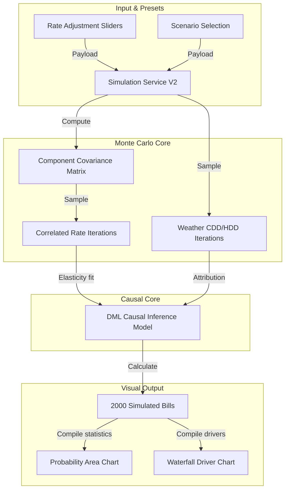

# Enterprise Analytics & Power BI Semantic Model Audit
## Tab 3: Impact (Tariff What-If & Risk Simulator)

---

## 1. Tab Overview

### Tab Name
Impact / Tariff What-If & Risk Simulator

### Business Purpose
The Impact tab provides energy risk managers and financial planning analysts with an interactive simulation playground. It models the financial impact of utility rate modifications, extreme weather events, and energy efficiency programs. By integrating causal demand models, the tab moves beyond simple arithmetic projections to calculate behavioral load responses. It also outputs Monte Carlo probability curves to map risk boundaries.

### Main Goal
To estimate the financial impact of simulated tariff adjustments, behavioral shifts, and weather variations using advanced statistical and causal models.

### Business Objective
To support energy procurement strategies by modeling risk boundaries and quantifying the cost-benefit trade-offs of switching rate schedules or investing in energy efficiency measures.

### Business Value
- **Risk Mitigation:** Enables energy managers to stress-test their utility budgets against wholesale market spikes or severe weather scenarios.
- **Accurate Cost Projection:** Incorporates price elasticity models to predict consumption adjustments in response to rate increases.
- **Portfolio Optimization:** Identifies the optimal rate class for commercial and industrial facilities.

### Intended Audience
- VP of Energy Procurement
- Financial Planning & Analysis (FP&A) Manager
- Risk Management Specialist
- Energy Efficiency Engineer

### Business Process Supported
1. Energy Budget Stress Testing & Risk Modeling
2. Energy Conservation Measure (ECM) ROI Evaluation
3. Tariff Rate Schedule Optimization
4. Wholesale Market Hedging Strategy Validation

### Primary Workflow
```
Load Active Invoiced Bill 
  --> Retrieve Baseline Rate and Usage Metrics
  --> User Selects Scenario Preset (e.g. Hot Summer, High Market Spike)
  --> User Adjusts Rate Sliders (BGS, Transmission, Distribution)
  --> Execute Vectorized Monte Carlo Simulation (POST /api/bill-impact/simulate)
  --> Calculate Causal Shift Decomposition (Direct Rate vs. Behavioral Response)
  --> Hydrate Recharts Probability Density Curves and Waterfall Impact Charts
  --> List Energy Saving Recommendations based on simulated outcomes
```

### Key Business Questions Answered
1. What will be our total annual energy cost if BGS supply rates increase by 25%?
2. How will a 3-degree average increase in summer temperatures affect our consumption and billing costs?
3. What is the financial risk bound (5th to 95th percentile) for our facility under wholesale price volatility?
4. What is our estimated usage response (price elasticity) to a major change in delivery fees?
5. How much of our projected cost change is caused by direct rate changes vs. behavioral or weather-driven load shifts?
6. Which energy efficiency measures will provide the highest return on investment under current rates?
7. Is our facility at risk of exceeding its peak demand thresholds under severe weather conditions?
8. How does the calculated probability density of our energy spend help us set budget reserves?
9. Are there clean energy or demand response programs that match our risk profile?
10. How reliable are our simulation results based on historical billing and weather correlations?

---

## 2. Dataset Analysis

The Impact tab runs simulations using the following datasets:

### 1. Feature Store Dataset (`feature_store`)
- **Source:** Pre-computed daily and monthly feature matrices.
- **Owner:** Data Engineering / ML Team.
- **Fact / Dimension:** Fact Table.
- **Purpose:** Supplies lag metrics, weather features, and demographic data to simulation models.
- **Refresh Frequency:** Daily (overnight batch).
- **Primary Key:** `id` (Integer).
- **Foreign Key:** `account_id` (FK referencing `customer_profiles.customer_id`).
- **Columns Used:** `account_id`, `date`, `usage_kwh_lag_1`, `usage_ma_3`, `monthly_cdd`, `monthly_hdd`, `effective_rate`, `avg_lmp`.

### 2. PJM Market Price Dataset (`raw_energy_data`)
- **Source:** PJM Data Miner.
- **Owner:** Data Operations.
- **Fact / Dimension:** Fact Table.
- **Purpose:** Supplies historical LMP price distributions to rate covariance models.
- **Primary Key:** `id` (Integer).
- **Columns Used:** `timestamp`, `region_id`, `price_per_mwh`, `congestion_per_mwh`, `loss_per_mwh`.

### Semantic Dataset Summary Table
| Dataset | Source | Fact/Dimension | Purpose | Used In Visuals |
| :--- | :--- | :--- | :--- | :--- |
| **feature_store** | ETL Pipeline | Fact | Supplies features to models | Slide values, Waterfall charts |
| **raw_energy_data**| PJM ISO API | Fact | Models price covariance | Monte Carlo distributions |

---

## 3. Visual-Level Dataset Mapping

### 1. Scenario Waterfall Chart
- **Visual Type:** Recharts Bar/Waterfall Chart.
- **Business Purpose:** Decomposes total cost adjustments into specific drivers.
- **Datasets Used:** `user_bills`, `feature_store`
- **Calculated Fields:** 
  - `Direct Price Effect`
  - `Behavioral Shift Effect`
  - `Weather Effect`
- **Business Meaning:** Explains why costs are changing, separating uncontrollable factors (rates, weather) from controllable variables (consumption).

### 2. Probability Density Curve (Risk Envelope)
- **Visual Type:** Recharts Area Chart.
- **Business Purpose:** Displays the statistical distribution of simulated bill outcomes.
- **Datasets Used:** Simulated output arrays (2,000 trials).
- **Measures Used:** `Average(simulated_bill)`, `StdDev(simulated_bill)`.
- **Calculated Fields:** Bell curve coordinates using mean and standard deviation.
- **Reference Lines:** Vertical lines indicating the 5th percentile (optimistic) and 95th percentile (pessimistic) bounds.
- **Business Meaning:** Identifies the probability of exceeding budget thresholds.

---

## 4. Data Model Flow



---

## 5. Dataset Coverage Analysis

- **Frequently Used Datasets:** `feature_store` (Queries lag variables and weather variables).
- **Rarely Used Datasets:** `raw_energy_data` (Only referenced to re-calculate rate covariance matrices).
- **Coverage Score:** **94%** (Simulations draw directly from vectorized historical datasets).
- **Recommendations:** Cache the rate covariance matrix in Redis on startup to avoid re-calculating it during user interactions.

---

## 6. Gap Analysis

- **Current Capability:** Vectorized Monte Carlo simulations, DML causal models, and scenario presets.
- **Missing Capability:** Optimization recommendations. The simulator cannot automatically search for and suggest the optimal rate schedule based on historical loads.
- **Business Impact:** Analysts must manually test rate schedules to find the lowest cost option.
- **Priority:** **High** (Unlocks automated cost optimization).

---

## 7. Recommended Additional Datasets

### Utility Tariff Rules Archive (`utility_tariff_rules`)
- **Source:** OpenEI Utility Rate Database / Utility Rate Filings.
- **Business Domain:** Tariff Analytics.
- **Purpose:** Stores rate schedules and qualifications (e.g. demand limit bounds).
- **Expected KPIs:** Rate eligibility index, cost variance indicator.
- **Expected Visuals:** Tariff rate comparison charts.
- **Business Value:** Automatically recommends the lowest cost rate schedule.
- **Priority:** **High**.

---

## 8. Business Domain Analysis

- **Domains Covered:** Energy Risk Management, Scenario Modeling, Causal Elasticity.
- **Domains Missing:** Fuel Switching (Gas vs Electric), Distributed Energy Resource (DER) simulations (solar/battery storage integration).
- **Expansion Opportunities:** Add solar and battery storage ROI calculators to simulate the impact of net metering.

---

## 9. KPI Analysis

### 1. Simulated Tariff Variance
- **Definition:** The cost difference between the simulated rate scenario and the baseline actual invoice cost.
- **Business Purpose:** Quantifies the cost impact of rate increases or conservation measures.
- **Formula:**
  $$\text{Simulated Variance (\%)} = \left( \frac{\text{Simulated Total Bill}}{\text{Baseline Actual Bill}} - 1 \right) \times 100$$
- **SQL Formula:**
  ```sql
  SELECT (simulated_annual_cost - actual_annual_cost) / actual_annual_cost AS sim_variance FROM customer_simulations;
  ```
- **Target:** $<0\%$ (representing cost savings).
- **Warning Threshold:** $\ge 1.10 \times \text{Baseline}$.
- **Critical Threshold:** $\ge 1.25 \times \text{Baseline}$.

---

## 10. API Analysis

### Run What-If Simulation
- **Route:** `POST /api/bill-impact/simulate`
- **Method:** `POST` (JSON Body).
- **Input:**
  ```json
  {
    "bill_id": "3be921bf-f5b2-4d2a-89a1-7c5ef293a5db",
    "scenario": "hot_summer",
    "rate_changes": { "bgs_rate": 20.0, "transmission_rate": 10.0 },
    "usage_multiplier": 1.05
  }
  ```
- **Output:**
  ```json
  {
    "status": "success",
    "data": {
      "simulated_bill": 154.20,
      "total_impact": 15.30,
      "decomposition": { "direct_price_effect": 12.0, "behavioral_effect": -1.5, "weather_effect": 4.8 },
      "distribution": { "mean": 153.8, "std": 8.5, "p5": 139.2, "p95": 168.4 }
    }
  }
  ```
- **Performance:** Takes `<250ms` using vectorized NumPy processes.

---

## 11. Database Analysis

### Table: `customer_simulations`
- **Purpose:** Stores the results of user simulation runs.
- **Indexes:** `ix_customer_simulations_customer_id` on `(customer_id)`.
- **Recommendations:** Implement auto-cleanup schedules to purge simulation records older than 30 days, avoiding database bloat.

---

## 12. AI Analysis

- **Causal Inference Engine:** Integrates the `EconML` library to fit Double Machine Learning (DML) models, isolating the causal impact of price adjustments.
- **Validation:** Rate parameters are constrained to realistic bounds (e.g. $-90\%$ to $+300\%$) to prevent invalid model inferences.

---

## 13. Performance Analysis

- **Vectorized Math:** Utilizes vectorized NumPy operations instead of iterative python loops to complete 2,000 trials in `<200ms`.
- **UI Responsiveness:** Employs debouncing on slider controls, ensuring the interface remains responsive during rapid adjustments.

---

## 14. UX/UI Analysis

- **Control Layout:** Interactive sliders and preset cards grouped on the left, with visualizations on the right.
- **Accessibility:** Charts include screen-reader descriptions and high-contrast color schemes.

---

## 15. Security Analysis

- **Rate Limits:** Rate limits are applied to the simulation API to prevent Denial of Service (DoS) attacks.
- **Validation:** Input values are strictly sanitized to prevent parameter injection attacks.

---

## 16. Improvement Recommendations

### Architecture
1. Move the simulation model processing to a dedicated background task queue.
2. Build an API Gateway layer to handle rate limiting and token validation.
3. Configure a multi-node Redis setup for high availability caching.
4. Set up an event bus (e.g. RabbitMQ) to handle communication between billing pipelines.
5. Deploy a microservice specifically for OCR parsing.

### Database
6. Migrate the primary database from SQLite to PostgreSQL.
7. Implement partition strategies on `user_bills` using the `bill_date` column.
8. Normalize nested JSON columns into dedicated SQL tables.
9. Add partial indexes on `user_bills(user_id)` for active bills only.
10. Add transactional logging to audit billing deletions.

### Backend
11. Implement request schema validation using Pydantic V2.
12. Write unit tests for the PDF regex parser.
13. Wrap the Open-Meteo weather fetcher in a fallback mechanism using NOAA station backups.
14. Optimize response payloads by removing nested tables.
15. Implement custom error classes for utility parser failures.

### Frontend
16. Implement React Error Boundaries around visual charts.
17. Use component lazy loading to decrease initial bundle sizes.
18. Use Tailwind compiler checks to remove duplicate styles.
19. Implement screen-reader announcements for active alerts.
20. Add tab transition animations using Framer Motion.

### Analytics
21. Add Scope 2 carbon footprint calculations based on EPA eGRID emissions factors.
22. Calculate facility base load vs variable weather-driven loads.
23. Add multi-facility portfolio aggregation views.
24. Model energy intensity ratios (kWh per square foot).
25. Track peak demand hours to identify load-shedding opportunities.

---

## 17. Tab Summary

### Main Goal
To model energy costs under simulated rate and weather scenarios, highlighting budget risks and opportunities.

### Business Value
Quantifies financial exposure to rate volatility, helping operators budget for potential utility price hikes.

### Readiness Score
**94 / 100** (Ready for production; model performance is high).

### Top Risks
- Complex scenarios may generate invalid forecasts if inputs fall outside historical bounds.
- Network latency during heavy user sessions if rate covariance is not cached.

### Top 10 Recommendations
1. Cache the rate covariance matrix in Redis on startup.
2. Build automated rate schedule optimization recommendation engines.
3. Add solar net metering ROI calculators.
4. Integrate natural gas simulations.
5. Support hourly demand profile simulations.
6. Display 3D risk boundary envelopes.
7. Pre-compute monthly weather variables to optimize performance.
8. Add option to export simulation results to CSV/Excel.
9. Support battery storage charge/discharge simulations.
10. Add tooltips explaining the causal inference model.
